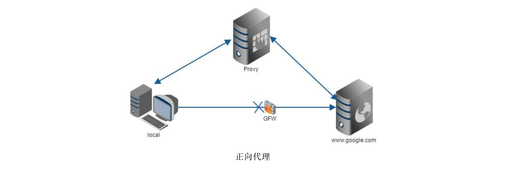

### nodejs搭建后端服务流程图

```
   browser -> nginx -> html
                    -> api
                       ｜
                       ﹀
                      logging -> logFile
                       ｜
                       ﹀
                   checkLogin <- session <- redis
                       ｜ y
                       ﹀
                     route -> controller -> db
                       ｜ not match
                       ﹀                    ⇅
                    notFound               mysql
```

<br>
> 通过nginx反向代理

- 分别代理到： 1. 前端静态资源；2. 接口
- 正向代理
    - 服务对象是客户端
    - 代理接收N多台客户端中a客户端的请求 并 转发给b服务端，接收b服务端的响应 并 转发给a客户端
    - 正向代理的过程，隐藏了真实的客户端，服务端不知道真实的客户端是谁，客户端请求的服务都被代理服务器代替来请求
- 反向代理
    - 服务对象是服务端
    - 接收a客户端的请求 并 转发给该组织的N多台服务端其中的b服务端，接收b服务端的响应 并 转发给a客户端
    - 反向代理的过程，隐藏了真实的服务端，客户端不知道真实的服务端是谁，服务端的响应都被代理服务器代替来响应




<br>

> 每次请求都需要记录日志
- 通过 流 的方式写入到log文件
- 通过shell命令，整理出阶段性log文件，定期清理log文件

<br>

> 用户登录相关
- http是无状态的协议，无请求上下文的联系；为了识别请求的身份，通过在浏览器cookie里写入sessionId的方式，每次请求cookie携带sessionId的方式，来识别请求的唯一性。
- session的读取与写入是非常频繁的，但session的数据量不是很大，为此选择高性能的内存数据库——redis，是非常合适的。
- session的流程：
    - 1. 用户登录
    - 2. 校验用户名和密码成功后，同步session到redis & set-cookie
    - 3. 下次登录时，校验session成功后，识别为某某用户
- 用户登录加密
    - 通过 crypto 对密码进行加密，以防止数据库泄露后得到 明文

<br>

> route相关
- 为了防止 xss攻击、sql注入，采用 mysql.escape转义sql特殊字符、xss转义代码 的方式

<br>

> 为了要用框架开发？
- 为了专注于业务开发，提高开发效率
- 目前web server开发框架有：Express、Koa2

<br>

> pm2
- pm2 是node进程管理工具，利用它可以简化很多繁杂的工作：性能监控、自动重启(进程保护)、负载均衡等
- 每个node进程可利用的系统资源是有限的，开启多个进程可以合理地利用硬件资源，提高web server的性能
